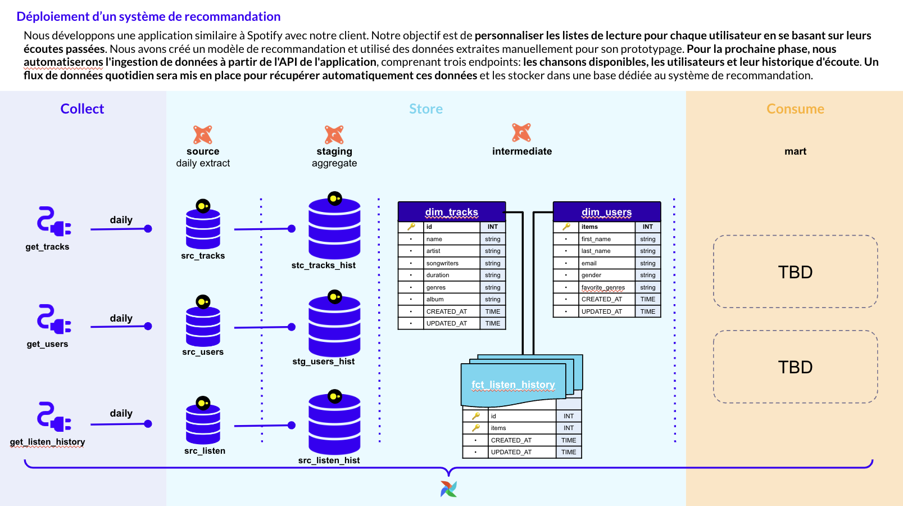

# Réponses du test

## _Utilisation de la solution (étape 1 à 3)_

run docker-compose/yml
## Questions (étapes 4 à 7)

### Étape 4

Avant d’engager un quelconque choix sur l’infrastructure à mettre en place je m’assurerai avec le client de cadrer un maximum les différentes subtilités du besoin pouvant avoir un impact sur la solution finale présente mais également les éventuelles évolutions futures pressenties. 

**Par exemple :** 
- Quel est le volume de données attendu ? Les données sont-elles structurées ou semi-structurées ?
- Les données sont-elles statiques ou évolutives (fréquence d'ajout/modification) ?
-  Quel historique de données avons nous à disposition ?
- Y a-t-il des exigences spécifiques en termes de performances pour certaines requêtes ou agrégations ?
….

Au regard des consignes procurées on sait que : 
- Une première phase de livraison de l’application est déjà existante. L’ingestion faite manuellement est à présent à automatiser. 
- Ceci au moyen d’une API comprenant trois endpoints : `/tracks` , `/users` & `/listen_history`
- On nous précise que le flux de donnée doit-être quotidien (et non en temps réel)
- Le modèle de recommandation est déjà existant.

On ignore en revanche : 
- La volumétrie de donnée attendue
- Les éventuelles transformations à appliquer
- L’output attendu

Nous devons donc pour chacune des source : 
- Automatiser l’ingestion
- Créer une table d’extraction
- Créer une table d’aggregation

Cela n’est pas requis présentement mais on pourrait imaginer connecter un outil de transformation de données découpant les couches de traitement comme cela : (à compléter)

Celui-ci serait alors à intégrer sur la BDD retenue. Bigquery, Redshift ou autre solution cloud. 
Cette solution présenterait l’avantage de procurer une vision centralisée du pipeline de donnée, des transformations et tests appliqués. 

Un modèle de donnée dimensionnel en étoile semble assez naturel à imaginer avec :
- une table de fait `fact_listen_history` contient l’historique des écoutes réalisées par un utilisateur. Elle contient des ids vers les tables `dim_users`  & `dim_tracks` où demeurent les informations complémentaires à leur sujet. Nous pourrions éventuellement réfléchir à éclater davantage le modèle en plus petites entités si des soucis de normalisation / intégrité des données étaient identifiés. 

- une fois les traitements de nettoyage appliqués, on pourrait imaginer créer des datamarts pour répondre aux besoins du modèle. 

Dans la perspective d’un travail organisé en sprint / en agile. La livraison présentée ce jour se concentre sur un MVP fonctionnel mais qui présente tout de même un certain nombre de limites  telles que : 
- La BDD duckdb en local n’est pas pérenne ni du point de vue de la volumétrie ni des besoins de traitements. 
- Des tests pourraient être implémentés d’amont en aval du pipeline.
- Le contenu des requêtes, leurs matérialisations (vues/tables…) et orchestration pourraient certainement être optimisées. 
- 
- En l’état, aucune logique autre que fonctionnelle n’a été réfléchie pour la proposition de datamarts. 
…. Et beaucoup d’autres améliorations dont je serai ravi de discuter avec vous !

Les prochains sprints pourraient être dédiés à leur implémentation.

### Étape 5

Réaliser un atelier de réflexion au préalable autour des métriques clés pour le client pour suivre la santé du pipeline permettrait de préciser les actions de testing les plus pertinente à mettre en place. Ceci pour trouver le bon équilibre entre une bonne qualité de donnée, un pipeline robuste et du code maintenble.

Quoi qu’il en soit, on pourrait imaginer : 
- Mettre en place des class sensor pour simuler des cas critiques
- Ajouter d’autres tests au folder déjà présent dans le dossier /test/
- Typer les queries, leurs entrées et sorties.
- Réaliser un dashboard de suivi des indicateurs critiques
- Itérer avec les consommateurs de données pour déployer des actions correctives
- Centraliser les tests dans une interface commune (dbt)
- Réaliser un dashboard de suivi des indicateurs critiques
- Une idée ça pourrait être aussi de mettre en place des tests sur les valeurs aussi
- Mettre en place une série de tests Github sur différentes branches via le fichier ci.yaml dans .github/workflows
- Passer son code dans black & pylint
- Utiliser le package unittest aussi 
- Tester la fraicheur des données

### Étape 6

Afin d'être capable de réaliser des recommandations automatisées et au fur et à mesure des écoutes de musique, il faudrait pouvoir interroger le endpoint get_listen_history en temps réel, cela peut-être via Kafka / Google Pub/Sub.
Les tables de dimensions dans l'absolu peuvent demeurer ingérées quotidiennement.

### Étape 7

Pour ré-entrainer le modèle il faudrait dans un premier temps trouver un moyen de valider la recommandation --> aka "Cette recommandation m'a été utile" et éventuellement développer un nouveau pipeline de ré-entrainement a fréquence X ou selon un déclencheur spécifié.
